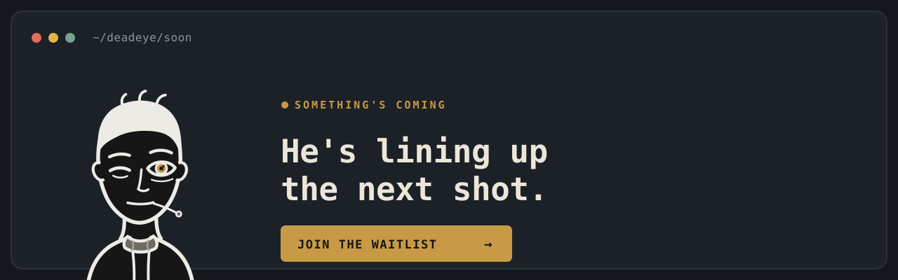

<p align="center">
  <picture>
    <source media="(prefers-color-scheme: dark)" srcset="assets/logo-dark.svg">
    
  </picture>
</p>

<h1 align="center">deadeye</h1>

<p align="center">
  <em>He doesn't waste shots.</em>
</p>

<p align="center">
  <a href="https://github.com/deepaksinghcs14/deadeye-cc/actions/workflows/ci.yml"></a>
  
  
  
  
</p>

He doesn't check twice, and he doesn't spray and pray. One round chambered,
one shot on target, and he's done — because the shot you never had to take
is the best one. deadeye puts that discipline inside your coding agent.

It watches what your agent is about to do — spawn a subagent, dump a noisy
test log, make a big multi-file edit — and fits the model, effort level, and
context to the task **before the tokens are spent, not after**. Left alone, a
coding agent spends more than a task needs; deadeye catches that at the choke
points it already sits on. Everything it remembers lives in one local file:
no hosted service, no API keys, no telemetry.

**[Full feature tour, with live examples → the site](https://deepaksinghcs14.github.io/deadeye-cc/)**

<p align="center">
  <a href="https://deepaksinghcs14.github.io/deadeye-cc/soon.html"></a>
</p>

## Numbers

Every figure is measured from a real run and logged to
`~/.deadeye/decisions.jsonl` — nothing averaged, nothing modelled. The
rewrite happens *before* the command runs, so only the part worth keeping
ever enters context.

| Real run | Before | After | Cut |
|---|---:|---:|---:|
| `go test` with one genuine failure | 485 B | 99 B | **79.6%** |
| This repo's own suite (202 lines, all passing) | 10,301 B | 55 B | **99.5%** |
| `npm install express mocha` (progress spam) | 553 B | 55 B | **90.1%** |
| Coder persona a subagent inherits, per spawn | 9,235 B | 1,099 B | **88.1%** |

Run `/deadeye-stats savings` to see your own. Quiet no-op events (95% of all
rows on one real machine) aren't logged at all — the log holds only the rows
where deadeye actually did something.

## How it works

```
1. Look      Cheap, deterministic signals: files touched, recent git activity, whether tests exist nearby, how the request reads, whether the task itself names something real, and whether it's a read-only subagent
2. Decide    The cheapest (model, effort) that should still clear the bar for this task
3. Apply     Rewrites the subagent's model, trims noisy command output, asks before risky multi-file edits
4. Learn     If you manually pick a bigger model than it recommended, it gets more cautious for that kind of task next time
```

The rule behind all four: **when unsure, a capable middle — not the priciest.**
Thin or shaky evidence defaults to the sonnet tier, reserving opus for genuinely
high-complexity work; picking cheaper needs real evidence above a confidence bar.
Optionally, an AI judge (`claude -p`, no API key) classifies the ambiguous cases
for a sharper call.
Every decision is printable: run `/deadeye-route` to see the full reasoning,
never a black box. deadeye advises by default and never touches your
`settings.json`; if anything inside it errors, your call passes through
untouched.

## Benchmark

Two questions, measured separately: does routing to a cheaper model actually
save money without losing quality, and does the PR reviewer actually catch
real bugs?

### Routing savings

Does routing to a cheaper model actually save money, or just do worse work? We
measured it: every task run on all three tiers, graded by a **hidden test the
model never saw**, priced from real billed `total_cost_usd` (deadeye off during
runs, so it's raw per-tier model cost).

**Identical, verified-correct output cost 3–9× more on opus than haiku** (median
~6×). And **5 of 6 well-scoped tasks passed on haiku** — including SemVer
precedence and a concurrent counter under `-race` — so downshifting the common
case is nearly free in quality. The one task that needed opus (a recursive
expression evaluator) is exactly the case routing sends *up*.

| Task | Band | haiku | opus | opus ÷ haiku |
|---|---|---:|---:|---:|
| counter | hard | $0.034 | $0.311 | **9.1×** |
| wordwrap | standard | $0.046 | $0.331 | **7.1×** |
| clamp | mechanical | $0.026 | $0.160 | **6.1×** |
| semver | hard | $0.055 | $0.265 | **4.8×** |
| csv | standard | $0.060 | $0.204 | **3.4×** |

Oracle routing (cheapest tier that passed) cut model cost ~63% vs all-opus on
this set — illustrative, since it depends on task mix; the per-task ratio above
is the robust, mix-independent claim. Full method, honest caveats, and the
pass/fail grid: **[the benchmark page](https://deepaksinghcs14.github.io/deadeye-cc/benchmark.html)**
· reproduce it in [`benchmarks/routing/`](benchmarks/routing/).

### Review quality (held-out)

Does the PR reviewer actually catch real bugs? We measured it on **24 real-world
pull requests across 17 projects**, each one shipping a bug the project *later
fixed* in a follow-up commit. deadeye reviewed the introducing PR **cold** — diff
and source only, no fix, no comments — and the project's own fix is the answer
key. A finding counts as a catch only when it matches what the fix changed;
anything ambiguous is scored a miss.

**Recall 61% (11/18) at 97% precision** — one false positive across 31 findings,
every finding re-verified in source by an adversarial pass. It caught **every
authorization regression in the set** (4/4) — the cross-file permission bugs a
diff-only reviewer misses — and was weakest on concurrency races (1/4), the
honest soft spot. Beyond the 24 seeded bugs it surfaced 17 more real issues on
the same PRs.

Held-out, graded against public git history, precision adversarially verified.
Full breakdown by bug class: **[the benchmark page](https://deepaksinghcs14.github.io/deadeye-cc/benchmark.html#review)**.

## Install

deadeye is a Claude Code plugin at its core, and also runs — to varying
depth — on four other hosts.

### Claude Code

```
/plugin marketplace add deepaksinghcs14/deadeye-cc
```
```
/plugin install deadeye@deadeye
```

**macOS/Linux**: that's everything. Hooks and slash commands are live
immediately, and the binary bootstraps itself on first use — downloaded
once from [Releases](https://github.com/deepaksinghcs14/deadeye-cc/releases),
sha256-verified, no extra step.

**Windows**: self-bootstrap isn't built yet, so the binary needs a manual
step after the two commands above:

1. Download `deadeye_windows_amd64.exe` (or `_arm64`) from
   [Releases](https://github.com/deepaksinghcs14/deadeye-cc/releases).
2. Either put it on `PATH` as `deadeye.exe`, or place it at the managed
   path deadeye's hooks look for: `%USERPROFILE%\.deadeye\bin\deadeye.exe`.
3. Run `deadeye version` to confirm it resolves. `/deadeye-status` flags a
   version mismatch if a stale copy shadows the plugin later.

### Codex CLI (experimental)

Install the binary, then `deadeye init codex` — it shows the exact
Codex hooks file changes (`$CODEX_HOME/hooks.json`, or `~/.codex/hooks.json`)
and writes them only after you confirm
(deadeye never edits another tool's config silently). You get output
trimming, the coder persona, the plan gate, `/deadeye-mute`, and the full
decision log; not Claude-style model routing. Older Codex builds may need
`[features] hooks = true` in the Codex config. Init also installs the
`$deadeye-pr`, `$deadeye-review`, and `$deadeye-vapt` user skills. Remove
with `deadeye uninstall codex`.

### Gemini CLI (experimental — context-injection tier)

`deadeye init gemini` writes a self-contained extension under
`~/.deadeye/gemini-extension/` and prints the `gemini extensions install`
command — deadeye never edits Gemini's own config. You get the coder
persona plus session guidance (codemap, vulnerable-dependency flag, soft
plan gate). The tool-level features (exfil guard, output trimming, routing)
wait on live schema verification rather than risk firing blind. Remove with
`deadeye uninstall gemini`.

### Cursor and Windsurf (persona only)

No hook contract, so these get the **coder persona only**, as a rules file:

```bash
deadeye init cursor      # writes .cursor/rules/deadeye.md
deadeye init windsurf    # writes .windsurf/rules/deadeye.md
```

Level-filtered to your `coder.default_level`, and uninstall removes only
what deadeye wrote. For the full engine, use Claude Code or Codex.

### Review commands on every host (experimental)

`deadeye init <host>` also installs all three on-demand review commands —
`/deadeye-pr` (a GitHub PR), `/deadeye-review` (the working diff, or
`--repo`), and `/deadeye-vapt` (a whole-service pen-test/VAPT pass) — in
that host's native format: a Codex user skill, a Gemini TOML command, a
Cursor skill, a Windsurf workflow. Windsurf's 12000-char workflow cap
drops the "Rigor" habits section and the learning loop/fix-acceleration
extras (and, for `/deadeye-vapt`, the OWASP id-mapping reference tables —
the tags and method still carry the full pass) to fit; every other host
gets the rubric in full. Experimental until live-verified.

### From source

```bash
go install github.com/deepaksinghcs14/deadeye-cc/cmd/deadeye@latest
```

### Uninstall

```bash
deadeye uninstall --purge   # removes the binary, the daemon socket, and ~/.deadeye
```

Then `/plugin uninstall deadeye@deadeye` in Claude Code.

## What it controls

Ten independent controls — each has its own on/off, and switching one off
never touches the others.

| What | Modes | What it does |
|---|---|---|
| Context hygiene | `off` / `on` | Trims verbose command output (test suites across nine ecosystems, builds, linters, installs, log tails) before it enters context, and flags wasteful patterns — re-reading unchanged files, re-running the same command, an oversized MCP response, a good moment to `/compact`. |
| Coder persona | `off` / `spotter` / `marksman` / `sniper` | A lean-first coding discipline — including a live security check on what's written and its dependencies — injected each session and into subagents. |
| Security | `off` / `advise` / `ask` | An exfiltration guard: a Read of a credential file, or a Bash command shipping one out, escalates to a permission prompt a prompt-injected model can't answer. Independent of the persona. |
| Codebase map | `off` / `on` | A persistent per-project map — skeleton, most-touched files, exploration notes — injected once per session so a fresh session doesn't re-explore from scratch. |
| Effort level | `off` / `advise` | Suggests lower effort for mechanical steps; no effect if `CLAUDE_EFFORT` is pinned. |
| Model choice | `off` / `advise` / `enforce` | Picks the model for a subagent — only when you didn't already choose one. |
| AI routing judge | `off` / `on` | Opt-in: when the cheap signals can't place a subtask, classify it with a `claude -p` call (haiku, no API key) instead of defaulting a tier. |
| Plan-first gate | `off` / `soft` / `hard` | Suggests (or requires) a short plan before a risky multi-file edit. |
| Workflow suggestion | `off` / `on` | Flags tasks that look like parallel/fan-out work — only ever suggests, never starts one. |
| Update check | `off` / `on` | Once/day background check for a newer release; asks (once per version) whether to update. |

Settings live in `~/.deadeye/config.json` (with an optional per-repo
`.deadeye.json` override); full schema in
[`schema/config.schema.json`](schema/config.schema.json). Four env vars are
kill switches: `DEADEYE=off` (everything), `DEADEYE_PREPROCESS=off`,
`DEADEYE_GATE=off`, `DEADEYE_CODER=off`.

Change any setting without editing JSON: **`/deadeye-config`** from chat (or
just say what you want — "turn off the plan gate"), **`deadeye config`** for an
interactive picker in your terminal, or **`deadeye config set <key> <value>`**.
`/deadeye-status` shows every setting with its key and allowed values; new
installs get a one-time welcome pointing at all of this.

## Commands

| Command | What it does |
|---|---|
| `/deadeye-status` | Modes, coder level, kill switches, model list, daemon health |
| `/deadeye-route [task]` | Shows what deadeye *would* decide for a task, and why — without doing anything |
| `/deadeye-config` | View or change any setting from chat, or interactively with `deadeye config` |
| `/deadeye-stats [savings\|context]` | Decision-log reports: measured-impact scoreboard (default), token-savings, per-session context bytes — ends with a link to the full visual report |
| `/deadeye-coder [level]` | Switch or report the coder persona level |
| `/deadeye-mute [off]` | Mute advisories and nags for this session (rewrites keep working) |
| `/deadeye-review [--repo]` | Four-lens self-review (over-engineering, correctness, performance, security) of the working diff, or the whole repo with `--repo` — the same rubric `/deadeye-pr` runs, before a PR exists |
| `/deadeye-guard` | Security review of the current diff — full OWASP-mapped coverage (Top 10:2025, API Security Top 10 2023, LLM Top 10:2025), deps, dependency auditors |
| `/deadeye-vapt` | Whole-service pen-test/VAPT pass — complete OWASP Top 10:2025, API Security Top 10 2023, and LLM Top 10:2025 coverage, ranked worst-first, every finding linked to its source |
| `/deadeye-pr [<PR>] [--post]` | PR review across four lenses; prints locally, opt-in to post to the PR. Findings with a mechanical fix get a code snippet (a GitHub suggestion block when posted), plus a closing paste-ready block for a coding agent. On Codex, invoke the installed skill as `$deadeye-pr`. Huge PRs fan out to parallel subagents where the host supports them. |
| `/deadeye-debt` | Ledger of every `deadeye:` shortcut marker in the repo |
| `/deadeye-help` | Quick-reference card for all of the above |
| `deadeye update` | Update the managed binary (sha256-verified, atomic) — for Codex-only installs |
| `deadeye config` | Interactive settings picker in your terminal (or `config get/set <key>`) |
| `deadeye lessons [reset [--surface <s>]]` | Show or clear the learning-loop history (routing escalations, coder misses, PR-review disputes), grouped by surface |
| `deadeye report` | Generate `~/.deadeye/report.html`, a self-contained visual status page, and print its path |
| `deadeye uninstall --purge` | Remove the binary, its background process, and all local state |
| `deadeye uninstall <host>` | Remove what `deadeye init <host>` wrote, for `codex`, `gemini`, `cursor`, or `windsurf` |

## Coder mode

deadeye's coding persona is the lazy-senior-dev discipline: it pushes every
change toward the leanest solution that actually works — question whether
the code needs to exist, stdlib before custom code, native before
dependencies, one line before fifty. Injected every session (it survives
compaction) and into subagents.

| Level | Discipline |
|---|---|
| `spotter` | Builds what's asked, names the leaner alternative in one line — you pick. |
| `marksman` | The lean-first ladder enforced: YAGNI, stdlib and native first, shortest working diff. **(default)** |
| `sniper` | One shot only — ships the one-liner and challenges the rest of the requirement. |

Deliberate shortcuts get a `deadeye:` comment naming the ceiling and upgrade
trigger, which `/deadeye-debt` collects into a ledger. Safety is never cut:
input validation, error handling, security, and accessibility hold at every
level. [See it per-level on the site →](https://deepaksinghcs14.github.io/deadeye-cc/#layers)

## Learning loop

Three surfaces now feed the same local store (`~/.deadeye/outcomes.jsonl`),
scoped per repo, decaying over 30 days, never silencing a check outright —
only ever raising the bar:

- **Routing**: an explicit model escalation raises the downshift threshold
  for that task shape (unchanged from earlier releases).
- **Coder mode**: when `/deadeye-guard` or `/deadeye-review` confirms a
  finding in code coder mode just wrote, the next session gets a one-line
  "recent misses in this repo" reminder. `/deadeye-pr` catching something
  from another reviewer that its own pass missed feeds the same reminder.
- **PR review**: a finding you dispute makes `/deadeye-pr` need stronger
  proof before reporting that lens again on this repo — `deadeye lessons
  priority` shows the live signal, and `deadeye lessons`/`reset --surface
  <s>` inspects or clears it per surface. `/deadeye-vapt` shares the same
  `security:` lens, so a disputed finding there raises the bar for
  `/deadeye-guard`/`/deadeye-review`'s security tags too, and back —
  one learning signal, not a separate ledger per skill.

`deadeye report` visualizes all three, including a trend chart for the
repo's most-recurring coder-mode miss.

## Development

```bash
make check   # vet, gofmt, tests -- everything CI runs
make build   # ./bin/deadeye
```

`scripts/gen-catalog.go` regenerates the compiled-in model/pricing table
after editing its seed prices — a release-time step, since there's no
reachable pricing API at runtime. It also writes `docs/site/catalog.json`,
a hosted copy every install refreshes in the background (`mode.catalog_check`,
~24h, read-only, toggle with `deadeye config set mode.catalog_check off`)
and prefers over the compiled-in table
when it's present and well-formed. That file can also be hand-edited
directly and pushed — no release needed to roll out a new model or price,
though the seed table should be brought back in sync before the next
`go run` overwrites it.

## FAQ

**Does it phone home?**
No telemetry, no API keys, no third-party service. Everything it remembers
lives in one file at `~/.deadeye/`. Two things leave your machine, both
through *your own* Claude login, never a deadeye-run service: the AI
routing judge (`mode.routing_judge`, on by default) sends an ambiguous
subtask's description — never your code — to `claude -p` to classify it,
only when the free signals below can't confidently place it themselves;
cached per task, fails open on any error, and is the one thing here that
blocks a hook response (up to 30s, on an uncached unsure task). Turn it
off for the old zero-network default. Separately, three small background
checks each send nothing of yours and never block a response: a
release-tag check (`mode.update_check`), an OSV.dev advisory lookup for
flagged dependencies (`coder.security_osv`), and a refresh of the hosted
model/pricing catalog (`mode.catalog_check`, see Development above).

**Why not just ask an LLM which model to use?**
For most tasks it doesn't have to: six cheap, predictable signals — files
touched, recent git activity, whether tests exist nearby, how the request
reads, whether it names something real, whether it's a read-only subagent —
are enough to make a confident, free call. When they're not — genuinely
ambiguous tasks, which is most of what actually reaches "unsure" in
practice — `mode.routing_judge` is on by default specifically to answer
that case with a real classification instead of defaulting the whole
bucket to the sonnet tier. Turn it off to keep the zero-network default
and take the heuristic's conservative default instead.

**Will it make Claude dumber?**
That's the exact failure mode it's built to avoid. When it isn't confident,
it defaults to the more capable option — cheaper always needs evidence
first. If you find a case where it under-powered a task, that's a bug;
report it with the `/deadeye-route` output.

**Why "deadeye"?**
Because efficiency isn't spending less — it's not missing.

## Contributing

Contributions welcome — see [CONTRIBUTING.md](CONTRIBUTING.md) for the ground
rules (the short version: fail open, go big when unsure, bring a regression
test you've watched fail). Security reports go through
[SECURITY.md](SECURITY.md) — never a public issue.

## License

[MIT](LICENSE) — the shortest license that hits. Third-party notices in
[THIRD-PARTY.md](THIRD-PARTY.md).
