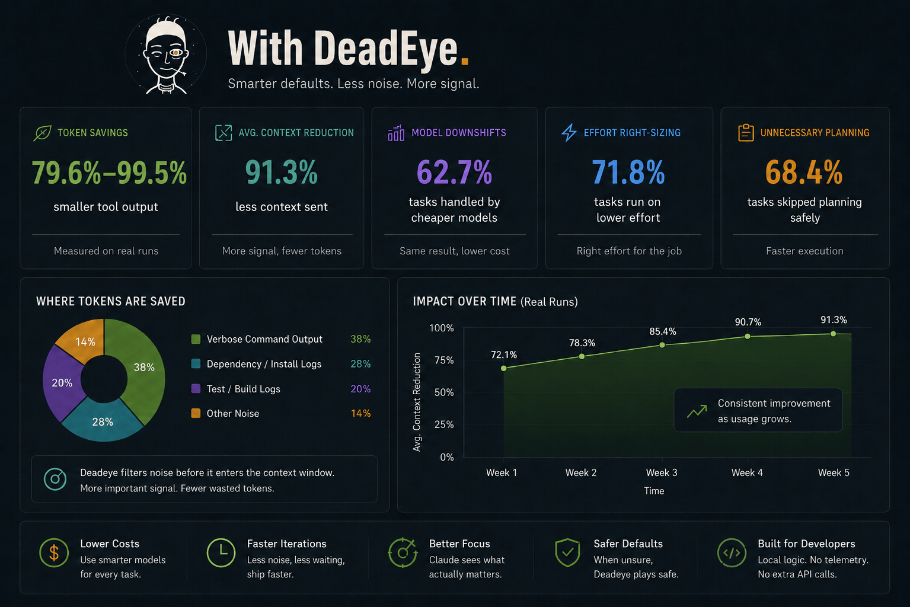

<p align="center">
  <picture>
    <source media="(prefers-color-scheme: dark)" srcset="assets/logo-dark.svg">
    
  </picture>
</p>

<h1 align="center">deadeye</h1>

<p align="center">
  <em>He doesn't waste shots.</em>
</p>

<p align="center">
  <a href="https://claude.com/claude-code"></a>
  <a href="https://developers.openai.com/codex/cli"></a>
</p>

<p align="center">
  
  
  
  
</p>

<p align="center">
  <a href="https://deepaksinghcs14.github.io/deadeye-cc/"></a>
</p>

<p align="center">
  <sub><b>Coder mode, measured:</b> 6,029-byte lean-first persona per session, surviving compaction &middot; subagent card 887 bytes vs the full ruleset &mdash; an <b>85.3% cut per spawn</b>, logged per spawn &middot; live counts on your machine: <code>/deadeye-gain</code></sub>
</p>

He doesn't check twice or spray and pray — he doesn't need to. deadeye is
a Claude Code plugin that watches what your agent is about to do — spawn a
subagent, dump a noisy test log, make a big multi-file edit — and picks
the cheapest model, effort level, and amount of context that will still
get the job done right. Left on its own, Claude Code tends to spend more
tokens than a task actually needs. deadeye catches that before the tokens
are gone. **[Site →](https://deepaksinghcs14.github.io/deadeye-cc/)**

## Before / after

You ask your agent to run the test suite before merging, and one test is
actually broken.

Without deadeye:

> All 14 lines of verbose output enter context — 4 `PASS` lines, then the
> failure, no differently weighted than if all 5 had passed.

With deadeye:

> ```
> --- FAIL: TestReconciliationAppliesTaxBeforeDiscount (0.00s)
> FAIL
> FAIL	canondemo/orders	0.539s
> FAIL
> ```

*(On that real run: 485 bytes shrank to 99 — a 79.6% reduction — and the
failure details stayed fully intact. On this repo's own full test suite,
which all passes: 10,301 bytes shrank to 55, a 99.5% reduction. On a real
`npm install express mocha`: 553 bytes of progress/funding/audit spam
shrank to 55, a 90.1% reduction, with errors and warnings still passed
through when they occur. Three separate real measurements, not one number
averaged across different situations — see
[the site](https://deepaksinghcs14.github.io/deadeye-cc/) for details, or
run `/deadeye-audit` to see your own numbers. One gotcha worth knowing: an
early, naive version of this filter could report a passing test suite as
"failed" whenever the filter pattern matched nothing. That's fixed now,
and tested against both directions.)*

deadeye also shows one quiet line at the end of a turn, telling you how
much it's kept out of context so far this session — `deadeye: ~9,600
bytes kept out of context this session (1 rewrite).` It only shows up
when that total has actually grown since the last time you saw it.

## Real task, end to end

Not a scripted demo — a real feature task run through the installed
plugin: add a `Mark()` method to a small package, write a test for it,
verify with `go test` and `go build`, and hand part of the work off to a
subagent. Here's the decision log for that one turn:

```
PreToolUse/Agent   advise         all evidence supports downshift: low complexity, confidence >= threshold
SubagentStart      noop
PreToolUse/Bash    rewrite        reason=test-filter
PreToolUse/Bash    rewrite        reason=build-filter
Stop               savings-shown  bytes_after=25800
```

(One thing has changed since this log was captured: as of v0.7.0 quiet
events aren't logged at all — on one real machine `noop` rows were 812 of
856 total, ~95% noise — so your log will show only the rows where deadeye
actually did something.)

deadeye recommended a cheaper model before the subagent even started, both
the test and build commands had their noisy output trimmed, and the turn
ended with `deadeye: ~25,800 bytes kept out of context this session (2
rewrites).` That 25,800 number is an estimate each rewrite rule carries
around (the same number `/deadeye-audit` prints, and it labels it as an
estimate right there in the output) — not a fresh measurement of this
specific task, whose real output happened to be pretty small. The
`485 → 99` and `10,301 → 55` numbers above are the actual measured ones;
this example is here to show the model-picking, output-trimming, and
end-of-turn summary all working together on one real task, not to add a
third headline number.

## How it works

```
1. Look      Checks a few cheap, deterministic signals: files touched, recent git activity, whether tests exist nearby, how the request reads
2. Decide    Picks the cheapest (model, effort) combination that should still clear the bar for this task
3. Apply     Rewrites the subagent's model, trims noisy command output, and asks before risky multi-file edits
4. Learn     If you manually pick a bigger model than it recommended, it remembers and gets more cautious for that kind of task next time
```

The rule behind all four steps: **when it doesn't know, it goes big.**
Missing or shaky evidence never buys a cheaper model or a lower effort
level — deadeye defaults to the most capable option. Picking something
cheaper requires real supporting evidence and a minimum confidence level;
picking something more capable never needs a reason. Every decision is
printable — run `/deadeye-route` any time to see the full reasoning, not
a black box. Full config schema:
[`schema/config.schema.json`](schema/config.schema.json).

## Install

```
/plugin marketplace add deepaksinghcs14/deadeye-cc
```
```
/plugin install deadeye@deadeye
```

That's everything on macOS/Linux — hooks, slash commands, and the binary
bootstraps itself on first use (downloaded once from Releases,
sha256-verified). On Windows the hooks and daemon work too (PowerShell
hook scripts ship in the plugin) — but grab the binary from
[Releases](https://github.com/deepaksinghcs14/deadeye-cc/releases)
yourself first (self-bootstrap isn't built there), and the optional
statusline badge is bash-only for now.

### Codex CLI (experimental)

deadeye also runs under OpenAI's Codex CLI, whose experimental hooks
system speaks (nearly) the same contract. Install the binary (from
source or Releases), then:

```bash
deadeye init codex
```

That shows you the exact `~/.codex/hooks.json` changes and writes them
only after you confirm — deadeye never edits another tool's config
silently. Codex will ask you to trust the hooks on first run (its
prompt, not ours), and hooks need `[features] hooks = true` in
`~/.codex/config.toml`.

What works on Codex — verified live, not assumed: output trimming and
all advisories (rewrites confirmed working through real Codex runs),
the coder persona (injected at session start, re-injected after
compaction, level switching by typing `/deadeye-coder …` as a prompt),
the plan gate (Codex edits arrive as `apply_patch`), `/deadeye-mute`,
and the full decision log. Not on Codex: model routing (no subagent
surface to route) and the statusline badge. Update any time with one
command — `deadeye update` fetches the latest release, sha256-verifies
it, and swaps it in atomically (the daemon hands over on the next hook
call). Remove cleanly with `deadeye uninstall codex`.

### From source

```bash
go install github.com/deepaksinghcs14/deadeye-cc/cmd/deadeye@latest
```

A binary already on PATH always beats the bootstrap, so your build stays in
charge.

### Uninstall

```bash
deadeye uninstall --purge   # removes the binary, the daemon socket, and ~/.deadeye
```

Then `/plugin uninstall deadeye@deadeye` in Claude Code.

## Commands

| Command | What it does |
|---|---|
| `/deadeye-status` | Shows current modes, coder level, kill switches, model list, and whether the background daemon is running |
| `/deadeye-route [task]` | Shows what deadeye *would* decide for a task, and why — without actually doing anything |
| `/deadeye-audit` | Prints a savings report straight from the decision log |
| `/deadeye-gain` | Compact measured-impact scoreboard from the same log |
| `/deadeye-coder [level]` | Switch or report the coder persona level |
| `/deadeye-mute [off]` | Mute advisories, plan-gate nags, and workflow hints for this session (rewrites keep working) |
| `/deadeye-review` | Over-engineering review of the current diff |
| `/deadeye-sweep` | Whole-repo over-engineering audit |
| `/deadeye-debt` | Ledger of every `deadeye:` shortcut marker in the repo |
| `/deadeye-help` | Quick-reference card for all of the above |
| `deadeye lessons [reset]` | Inspect (or clear) the recorded routing outcomes that bias future decisions |
| `deadeye update` | Update the managed binary to the latest release (sha256-verified, atomic) — the one-command updater for Codex-only installs |
| `deadeye uninstall --purge` | Removes the binary, its background process, and all local state |

## Coder mode

deadeye also ships a coding persona: a lazy-senior-dev discipline that
pushes every change toward the leanest solution that actually works —
question whether the code needs to exist at all, reach for the standard
library before custom code, native platform features before dependencies,
one line before fifty. It's injected at the start of every session
(surviving compaction) and travels into subagents too.

Three intensity levels:

| Level | What it does |
|---|---|
| `spotter` | Builds what's asked, but names the leaner alternative in one line — you pick |
| `marksman` | The lean-first ladder enforced. Shortest working diff. **Default.** |
| `sniper` | Maximum minimalism — ships the one-liner and challenges the rest of the requirement in the same breath |

- Switch any time: `/deadeye-coder spotter|marksman|sniper|off`
- Persist a default for new sessions: `/deadeye-coder default <level>`
  (writes deadeye's own `~/.deadeye/config.json` — never Claude's settings)
- Turn off mid-session by saying exactly `normal mode` or `stop coder`
- Kill switch: `DEADEYE_CODER=off`

### How it works

One canonical ruleset ships embedded in the deadeye binary. At every
session start the background daemon prints it straight into the model's
context, filtered to the active level — so a `marksman` session never
pays tokens for the `spotter` and `sniper` rows. Long sessions hold: when
Claude Code compacts the conversation, the SessionStart hook fires again
and the persona is re-injected at whatever level you'd switched to.
Subagents inherit it too — but not the whole thing: they get a condensed
card carrying just the behavior-bearing rules. Measured from the decision
log: **6,029 bytes per spawn before, 887 after — an 85.3% cut**, paid on
every single subagent your sessions ever launch. (Scope subagent
injection with `coder.subagent_matcher` in config if you only want it in
some agent types.)

Which level governs a session is resolved in strict order: the
`DEADEYE_CODER=off` kill switch wins, then an explicit `/deadeye-coder`
switch you made this session, then `coder.default_level` from config,
then the built-in default (`marksman`). Level switches are handled by the
daemon, take effect on your next message, and last until the session ends.

### What it changes in a real task

The persona is a decision ladder the model climbs before writing anything,
stopping at the first rung that holds:

1. Does this need to exist at all? Speculative need → skip it, say so in one line.
2. Already in this codebase? Reuse the helper that's three files over.
3. Standard library does it? Use it.
4. Native platform feature covers it? A DB constraint over app code, CSS over JS.
5. An already-installed dependency solves it? Never add a new one for what a few lines can do.
6. Can it be one line? One line.
7. Only then: the minimum code that works.

Concretely, the same request comes back differently per level. Ask for
"a cache for these API responses" and:

- **spotter** builds the cache, then adds: "FYI: `functools.lru_cache`
  covers this in one line if you'd rather not own a cache class."
- **marksman** puts `@lru_cache(maxsize=1000)` on the fetch function and
  notes what was skipped and when to add it.
- **sniper** declines to cache until a profiler says so — and tells you
  what one line to add when it does.

Answers follow a fixed shape — code first, then at most three short
lines: what was skipped, and when to add it. Bug fixes go to the root
cause (one guard in the shared function every caller routes through, not
a patch on the one path the ticket named). And the discipline never cuts
safety: input validation, error handling that prevents data loss,
security, and accessibility survive every level.

Comments get their own discipline: terseness governs the *response*,
never the code's why-comments — the persona comments the constraint or
tradeoff the code can't show, renames before it annotates, deletes
comments that restate the next line, and gives every exported function a
one-line contract doc. Deliberate corner-cuts use a pinned, greppable
grammar — `deadeye: <shortcut>. ceiling: <limit>. upgrade: <trigger>.` —
so `/deadeye-debt` parses the ledger reliably, and `TODO` stays reserved
for work not done yet.

When the persona does deliberately cut a corner with a known ceiling, it
leaves a `deadeye:` comment naming the ceiling and the upgrade trigger —
`/deadeye-debt` collects those into a ledger so shortcuts get tracked
instead of forgotten, `/deadeye-review` checks the current diff for
over-engineering, and `/deadeye-sweep` audits the whole repo for what's
still cuttable. An optional statusline badge shows each session's live
level; deadeye will offer (once) to set it up, and never edits your
settings itself.

> **Already running another lean-coding persona plugin?** Uninstall it
> before enabling coder mode — two overlapping personas means paying for
> both rulesets every session.

## How this fits with Claude Code's built-ins

Claude Code ships its own `/code-review` (with a paid multi-agent
"ultra" tier), `/simplify`, `/security-review`, plan mode, and size-based
output truncation. deadeye doesn't compete with those — it covers what
they don't:

| Claude Code built-in | What deadeye adds |
|---|---|
| `/code-review` / `/simplify` — correctness & cleanup reviews, on demand | `/deadeye-review` is the *lean lens only*: verified findings, `net: -N lines` accounting, and cuts that flow into the `deadeye:` debt ledger. Run it as the instant local pass; escalate to `/code-review ultra` for depth before a merge |
| Plan mode — exists, but nothing triggers it | deadeye's plan gate notices a risky multi-file edit coming and nudges *into* plan mode |
| Bash output truncation — size-based, at 30,000 chars | deadeye rewrites commands *before they run* so only failure context enters at all — content-based, and it stacks under the native cap |
| Subagent models — inherit the parent's model | deadeye recommends the cheapest tier the evidence supports, explains why, and learns from your escalations |
| Coding persona — none | Coder mode: the lean-first discipline, injected every session, surviving compaction, traveling into subagents |

## The six things it controls

| What | Modes | What it does |
|---|---|---|
| Context hygiene | `off` / `on` | Trims verbose command output before it enters context — test suites (Go, JS, Python, Rust, Java, Gradle, .NET, Ruby, PHP), builds, linters, package installs, pod logs, log tails. Flags unbounded dumps before they run: unscoped `git diff`/`git log`, `terraform plan`, `kubectl get -o yaml`, `npm ls`, bare `find`/`tree`/`du`, full package lists, and content-mode Grep with no limit. Also flags wasteful reads: re-reading a file that hasn't changed, whole-reads of huge files, and running the identical command twice in a row |
| Coder persona | `off` / `spotter` / `marksman` / `sniper` | The lean-first coding discipline above, injected per session and into subagents |
| Effort level | `off` / `advise` | Suggests using lower effort for mechanical steps; has no effect if `CLAUDE_EFFORT` is already pinned for the session |
| Model choice | `off` / `advise` / `enforce` | Picks the model for a subagent — only when you didn't already choose one yourself |
| Plan-first gate | `off` / `soft` / `hard` | Suggests (or requires) a short plan before a risky multi-file edit |
| Workflow suggestion | `off` / `on` | Flags tasks that look like they'd benefit from running many things in parallel — only ever suggests it, never starts one on its own |

Each of these works independently — you can turn any one off without
affecting the others. Settings live in `~/.deadeye/config.json`, with an
optional project-level `.deadeye.json` that overrides it for one repo.
Four env vars act as kill switches: `DEADEYE=off` turns everything off;
`DEADEYE_PREPROCESS=off`, `DEADEYE_GATE=off`, and `DEADEYE_CODER=off`
turn off just the context hygiene, just the plan gate, or just the coder
persona, respectively.

## Development

```bash
make check   # vet, gofmt, tests -- everything CI runs
make build   # ./bin/deadeye
```

`scripts/gen-catalog.go` regenerates the compiled-in model/pricing table
after editing its seed prices — there's no reachable pricing API to fetch
from at runtime, so this is a release-time step, not a background refresh.

## FAQ

**Does it phone home?**
No. Everything it remembers lives in one file on your own machine, at
`~/.deadeye/`. No hosted service, no API keys, no telemetry.

**Why not just ask an LLM which model to use?**
Four cheap, predictable signals — how many files are touched, recent git
activity, whether tests exist nearby, and how the request is phrased — are
enough to make a reasonable call, and they're free to check (no extra API
call needed). Asking an LLM to decide would spend tokens just to figure out
how to save tokens, and would add a network dependency this tool is
specifically built to avoid.

**Will it make Claude dumber?**
That's exactly the failure mode it's built to avoid. When deadeye isn't
confident about a task, it defaults to the more capable option — picking
something cheaper always requires real evidence first. If you ever find a
case where it under-powered a task, that's a bug — report it along with
the `/deadeye-route` output.

**What doesn't it know how to do (yet)?**
It can't tell whether an edit actually broke something later — it only
knows when you manually pick a bigger model than it suggested, not whether
a test started failing afterward. It doesn't know which other repos depend
on the one you're editing — that's a different tool's job,
[greybeard](https://github.com/deepaksinghcs14/greybeard). And it can't
tell whether you approved or declined a plan-gate prompt, because Claude
Code doesn't report that back to plugins — so it just asks once per task
and doesn't ask again either way.

**Why "deadeye"?**
Because efficiency isn't spending less — it's not missing.

## License

[MIT](LICENSE) — third-party notices in [THIRD-PARTY.md](THIRD-PARTY.md).
